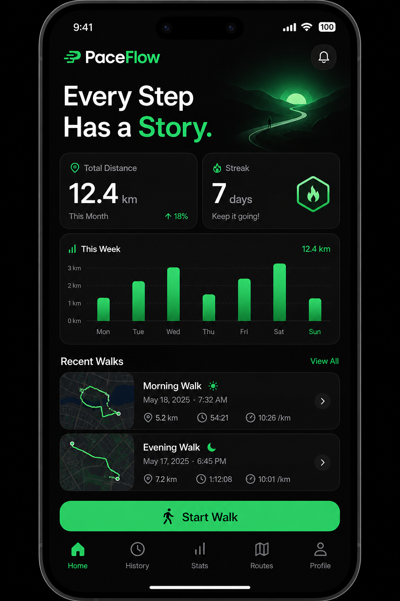
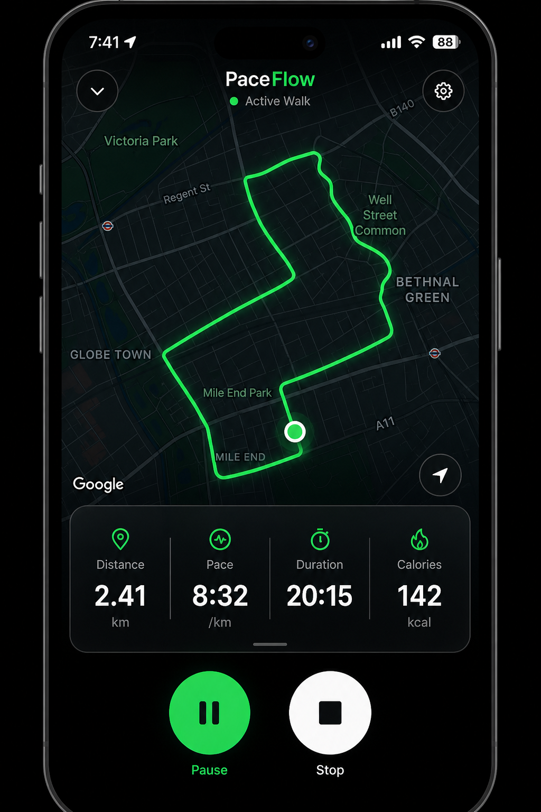
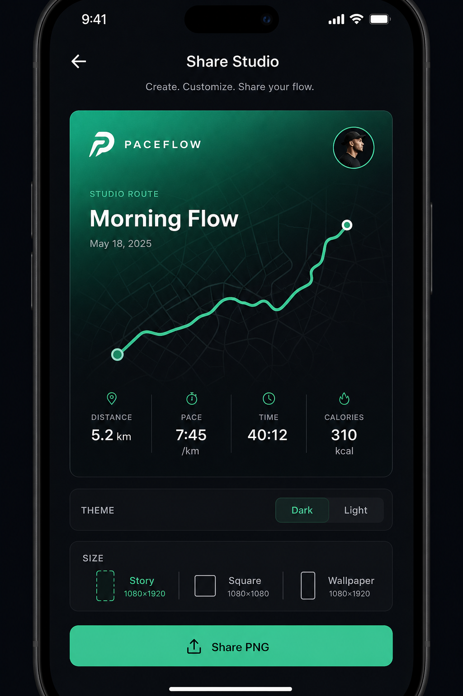

# PaceFlow

**Every Step Has a Story.**

Premium walking tracker for Android — high-accuracy GPS routes, progress insights, and Strava-quality shareable route cards.

## Interface preview

| Dashboard | Live tracking | Share Studio |
| --- | --- | --- |
|  |  |  |

## Stack

- Flutter 3.44+ / Dart 3.12+
- Riverpod · Clean Architecture · Drift (SQLite)
- Firebase Auth, Firestore, Storage, FCM, Analytics, Crashlytics
- Google Maps · Geolocator · Foreground location service

## Quick start

1. Install Flutter stable and accept Android licenses.
2. Create a Firebase project and enable Email/Password + Google Sign-In.
3. Run FlutterFire (recommended) **or** set dart-defines:

```bash
flutterfire configure --project=YOUR_PROJECT --platforms=android --out=lib/firebase_options.dart
```

4. Restrict a Google Maps SDK key to `com.paceflow.paceflow` and set it in:

`android/app/src/main/AndroidManifest.xml` → `com.google.android.geo.API_KEY`

5. Copy `android/key.properties.example` → `android/key.properties` for release signing.

6. Deploy rules:

```bash
firebase deploy --only firestore:rules,firestore:indexes,storage
```

7. Run:

```bash
flutter pub get
dart run build_runner build --delete-conflicting-outputs
flutter run
```

Debug APK (no device required to compile):

```bash
flutter build apk --debug
# → build/app/outputs/flutter-apk/app-debug.apk
```

Maps API key (Android): add to `android/local.properties`:

```
MAPS_API_KEY=your_google_maps_sdk_key
```

## Architecture

See `docs/PHASE1_PRODUCT_REQUIREMENTS_AND_ARCHITECTURE.md` and `docs/PHASE3_PROJECT_STRUCTURE.md`.

```
lib/
  app/           # theme, router, MaterialApp
  core/          # database, DI, errors, logging, utils
  features/      # auth, tracking, history, statistics, sharing, settings…
  shared/        # reusable widgets
```

## Features

- Email + Google auth, profile, forgot password, delete account
- Start / pause / resume / stop walks with background GPS
- Live route map, pace, distance, calories, steps, elevation
- Offline-first Drift storage + sync queue
- Dashboard, weekly/monthly/yearly stats, streaks, badges, PRs
- Share Studio: Story / Square / Wallpaper PNG export
- Local notifications + FCM hooks
- Material 3 light/dark, glass accents, brand emerald (#22C55E)

## Tests

```bash
flutter test
flutter test integration_test/app_smoke_test.dart
```

## Release (Play Store)

See `docs/PHASE10_PLAY_STORE_RELEASE.md` and `store_listing/`.

```bash
flutter build appbundle --release
```

## Legal

Templates in `assets/legal/` require attorney review before publishing.

## License

Proprietary — All rights reserved.
